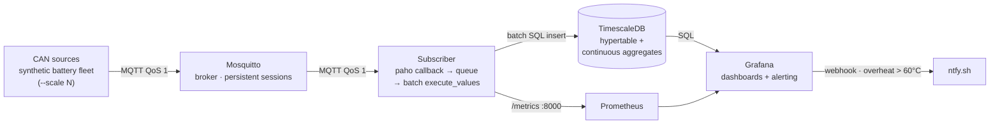
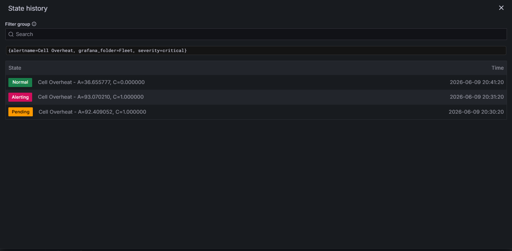
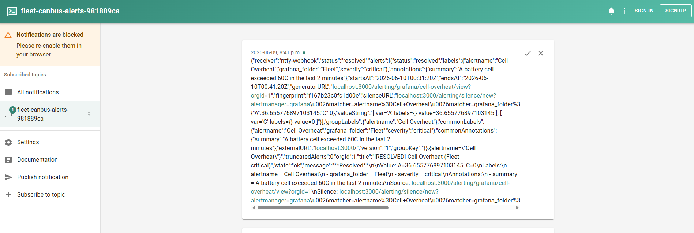

# Fleet CAN-bus Telemetry Pipeline

[](https://github.com/This-is-joejoe/fleet-canbus/actions/workflows/ci.yml)

Real-time CAN-bus telemetry pipeline simulating a fleet of battery-powered devices. Synthetic CAN frames → MQTT broker → time-series database → Grafana dashboards + alerting, with Prometheus observability, data retention, and proven zero-loss delivery across subscriber restarts.

---

## Architecture



Eight services run in one Docker Compose internal network, addressing each other by service name. Only ports 3000 (Grafana), 9090 (Prometheus), 1883 (MQTT), 5432 (Postgres) are exposed to the host; the subscriber's `/metrics` endpoint is internal-only (`expose: 8000`).

## Stack

| Layer | Tool |
|---|---|
| CAN encoding | `cantools` + `python-can` |
| Message bus | Mosquitto (MQTT v5, persistent sessions, disk persistence) |
| Subscriber | paho-mqtt v2 → bounded queue → batched `execute_values` insert |
| Time-series DB | TimescaleDB (hypertable + continuous aggregates + retention) |
| Metrics | `prometheus-client` → Prometheus |
| Dashboards | Grafana (provisioned as code) |
| Alerting | Grafana unified alerting → ntfy.sh webhook |
| Orchestration | Docker Compose |

## Quickstart

### Local dev

```bash
pip install -e ".[dev]"
pytest -m "not integration"          # fast unit suite
docker compose up -d mosquitto       # broker for integration tests
pytest -m integration                # zero-loss reliability test
```

### Run the full stack

```bash
docker compose up -d --build
```

Then browse:
- **Grafana** http://localhost:3000 (admin/admin) → *Fleet Overview*, *Pipeline Health*
- **Prometheus** http://localhost:9090 → Status → Targets (subscriber UP)

### Standalone simulator (broker already running)

```bash
python -m fleet_canbus.cli --device-id device-001 --rate-hz 10 --duration 30
```

---

## Scale & throughput

Scale the synthetic fleet with a Compose override (each replica self-assigns a `device-<hostname>` id and publishes at 200 Hz):

```bash
docker compose -f docker-compose.yml -f docker-compose.scale.yml up -d --scale simulator=30
```

### Measured results

**Test hardware:** AMD Ryzen 5 5600X (6 cores / 12 threads), 32 GB RAM, Docker Desktop (Linux VM: 12 CPU, ~15.5 GB). All producers, broker, subscriber, and DB **co-located on one machine** — this is a synthetic stress test, *not* real fleet traffic.

| Config | Sustained ingest | Inserted | Dropped | Queue depth |
|---|---|---|---|---|
| 30 sims, `executemany` (before) | ~2,160 msg/s | ~2,160 rows/s | ~2,445/s (queue_full) | 10,000 (pinned) |
| **30 sims, `execute_values` (after)** | **~5,240 msg/s** | **~5,240 rows/s** | **0** | ~137 |
| 50 sims, `execute_values` | ~4,509 msg/s | ~4,509 rows/s | 0 | ~5 |

### What the numbers say

- **The DB-writer batch insert was the bottleneck, not the architecture.** psycopg2's `executemany` issues one statement *per row*; switching to `psycopg2.extras.execute_values` (one multi-row `INSERT ... VALUES %s` per flush) gave a **~2.4× throughput gain**, eliminated all `queue_full` drops, and drained the queue from pinned-at-10k to a shallow ~137.
- **After the fix the consumer is no longer saturated** — at both 30 and 50 simulators the queue stays shallow and drops are zero, i.e. the subscriber + DB absorb everything offered.
- **50 simulators yield *less* aggregate throughput than 30** (~4,509 vs ~5,240). CPU was not saturated (~495 % of 1,200 % available, load ~4.7/12); the limit is **scheduling contention from co-locating 50 publisher containers** with the consumer/broker/DB on one 6-core desktop — each simulator drifts below its 200 Hz target. This is a *test-harness* artifact, not a pipeline ceiling: with producers on separate hardware the consumer would push well past 5k.

**Defensible headline:** ~5,240 msg/s sustained, zero loss, at 30 co-located simulators — bounded by synthetic-producer co-location, with the consumer path proven to have headroom.

---

## Retention

Three-tier retention keeps raw data short and aggregates long, matching how time-series value decays:

| Hypertable | Resolution | Retained |
|---|---|---|
| `battery_telemetry` | raw (per-step) | 7 days |
| `telemetry_1min` | 1-minute rollup | 30 days |
| `telemetry_1hour` | 1-hour rollup | 365 days |

Retention runs as TimescaleDB background jobs that **drop whole time chunks** (O(1) metadata op) rather than row-by-row `DELETE`. Verify:

```bash
docker compose exec timescaledb psql -U fleet -d fleet \
  -c "SELECT hypertable_name, config FROM timescaledb_information.jobs WHERE proc_name = 'policy_retention';"
```

---

## Alerting

A Grafana unified-alerting rule queries TimescaleDB for peak cell temperature over the last 2 minutes; if it exceeds **60 °C** for 1 minute it fires to an **ntfy.sh** webhook.

- Pick an unguessable topic and set it in `config/grafana/provisioning/alerting/contact-points.yaml` (`https://ntfy.sh/<your-topic>`), then subscribe to it in the ntfy app or web page.
- Trigger end-to-end: `docker compose run --rm -e RATE_HZ=10 simulator python -m fleet_canbus.cli --inject-fault overheat`

| Grafana rule firing | ntfy push |
|---|---|
|  |  |

---

## Reliability (zero message loss)

Zero loss across a subscriber restart is guaranteed by three things working together and proven by an integration test (`tests/integration/test_reliability.py`):

1. **Mosquitto disk persistence** — queued messages survive a *broker* restart.
2. **Persistent MQTT v5 session** — fixed `client_id` + `clean_start=False` + `SessionExpiryInterval`, so the broker queues QoS-1 messages while the subscriber is offline.
3. **QoS-1 subscription** — only QoS ≥ 1 messages are queued for an offline session.

The test takes the subscriber offline, publishes while it's down, reconnects with the same `client_id`, and asserts every message is delivered. It runs in CI against a real Mosquitto service container.

---

## Deployment

`docker-compose.public.yml` runs the full stack as a hardened public demo: only
Caddy is internet-facing (automatic HTTPS via Let's Encrypt), Grafana is exposed
as **anonymous read-only**, and Postgres/Prometheus/MQTT stay on the internal
Docker network. Retention policies keep disk bounded so a free-tier box runs
indefinitely. Full runbook (Oracle Cloud Always Free): [`docs/deployment.md`](docs/deployment.md).

```bash
docker compose -f docker-compose.public.yml up -d --build
```

## Status

Complete and running end-to-end:

- CAN/DBC synthetic simulation + MQTT v5 publisher
- Ingestion: bounded-queue subscriber → batched `execute_values` insert → TimescaleDB hypertable + continuous aggregates + tiered retention
- Observability: `prometheus-client` metrics → Prometheus → Grafana dashboards
- Alerting: overheat rule → ntfy.sh webhook
- Zero-loss delivery across restarts (persistent MQTT v5 session + broker disk persistence), proven by a CI integration test
- Scale-out to 50 simulators with a documented, defensible throughput analysis
- Hardened public deployment behind Caddy HTTPS

**Possible extensions:** a FastAPI admin/control-plane API (device registration, health queries); managed cloud infra (RDS/MSK-style) in place of the single-box Compose.

## Project layout

```
.
├── src/
│   ├── fleet_canbus/                # device side
│   │   ├── dbc/battery_fleet.dbc    # CAN signal definitions (bundled package data)
│   │   ├── simulator.py             # synthetic battery state + CAN frame encoder
│   │   ├── publisher.py             # MQTT publisher
│   │   └── cli.py                   # entry point (self-assigned device_id)
│   └── fleet_subscriber/            # cloud side
│       ├── subscriber.py            # paho callback → bounded queue
│       ├── db_writer.py             # batched execute_values insert
│       ├── metrics.py               # Prometheus counters/gauge
│       └── cli.py                   # service entry point
├── tests/
│   ├── integration/test_reliability.py   # zero-loss across restart (needs broker)
│   └── *.py                              # unit tests
├── config/
│   ├── mosquitto.conf               # broker (persistence enabled)
│   ├── timescaledb/init.sql         # schema + hypertable + aggregates + retention
│   ├── prometheus/prometheus.yml    # scrape config
│   ├── caddy/Caddyfile              # reverse proxy + automatic HTTPS (public deploy)
│   └── grafana/provisioning/        # datasources, dashboards, alerting (as code)
├── docs/deployment.md               # public deployment runbook (Oracle Cloud)
├── docker-compose.yml               # full stack (local dev)
├── docker-compose.scale.yml         # --scale override for the stress fleet
├── docker-compose.public.yml        # hardened public deployment (Caddy HTTPS)
└── .github/workflows/ci.yml         # lint + unit + integration on push/PR
```
